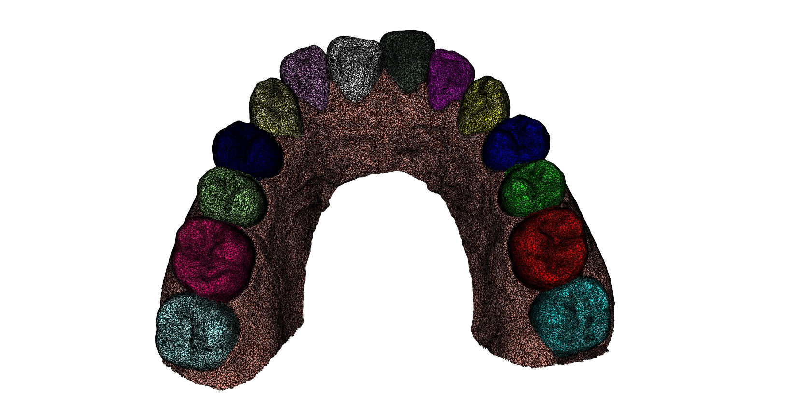
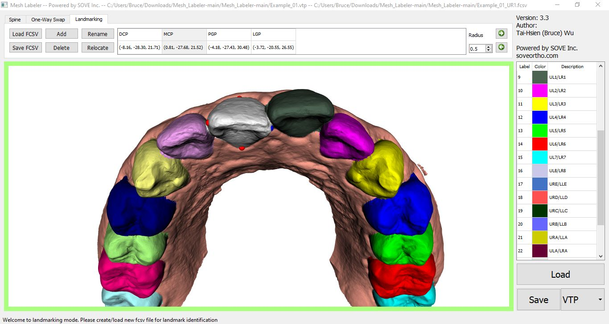

Mesh Labeler4 – User Manual
==========================

Author: [Tai-Hsien Wu](https://github.com/Tai-Hsien)

This project is partially powered by [SOVE Inc.](https://soveortho.com) and is mainly developed based on [Visualization Toolkit (VTK)](https://vtk.org/) and, especially, [vedo](https://github.com/marcomusy/vedo).

This program is originally developed to conveniently label/annotate dental mesh model. It can also work on any other type of mesh model.

------------
Current version: 4.2

* added reset button for landmarking
* removed the spline model
* added brush mode
* added "un-do" one action process (ctrl+z) in brush mode
* add hotkeys to save FCSV file and relocate a landmark
* No show wireframe as default
* fixed the color bug when label values are not continuous

------------

1.  Download installer from <https://www.dropbox.com/scl/fi/3ehccm85ozdm6ppko1b5u/Mesh_Labeler4p2_Setup.exe?rlkey=booqrzsfxq8auyyoh571oyl4f&dl=0> (click the download button on the top right). The previous v3.4 could be avaialbe from <https://www.dropbox.com/s/n9d4c9x5p7szopn/Mesh_Labeler3p4_Setup.exe?dl=0>.

2.  Execute the downloaded installer to install the program. You can find the shortcut of **Mesh Labeler** in Windows Start menu and Desktop (if it is installed for all user, you might need to search "Mesh Labeler" in the search bar).
	
3. 	Once the program is launched, you will see the user interface, as shown below.

4.  Use the bottom-right button **Load** to open a mesh file. Currently, the program supports VTP (with a cell array named **Label**) and STL, OBJ, and PLY files. There are four examples (Example_01.vtp, Example_02.stl, Example_03.obj, and Example_04.ply) that you can download via my github.

**Note: For those files that do not contain the cell array "Label" (e.g., STL, OBJ, PLY), the program will initially generate a cell scalar array called "Label" and assign 0 (i.e., all background) to the array for each cell (i.e., for each triangle) after loading them. The screenshot after loading a VTP with the cell array "Label" will look like below.**

5.  From Version 2, users can define the number of labels, label color, and label description by themselves. To do it, please modify  the **colormap.csv** in the installed folder of **Mesh_Labeler** (e.g., C:\Program Files\Mesh Labeler), which is a CSV file containing five columns: **Label, R, G, B, Descriptions**. Please keep the headers as the default file. Each row corresponds to a label.

6.  The view on the scene can be changed by using various mouse actions, as
    follows:

-   Rotating the mouse wheel upwards will zoom in, and downwards will zoom out.

-   Holding the middle mouse button down and dragging will pan the scene or
    translate the object.

-   Holding the left mouse button down and dragging will rotate the camera/actor
    in the direction moved.

7.  There are two methods to annotate a mesh. Users can go for each method by selecting the corresponding tab. Different methods have different input(s) under their tabs.

    **(1) Brush Method: Change label by selecting cells (triangles)**
The most straightforward way to select cells is by using a brush tool. Press "b" to activate "Brush Mode" (you can check the status bar to confirm if Brush Mode is on or off).
Once you're in Brush Mode, you'll see small red points that indicate potential selections as you move your mouse over the model. To select cells, simply right-click and drag the brush tool across the model. The selected cells will be highlighted in gray.
To remove a part of the selection, hold down the "ctrl" key while right-clicking and dragging. To adjust the brush size, hold down "ctrl" and scroll the mouse wheel up or down. Additionally, you can undo actions by pressing "ctrl+z".

    **(2) One-Way Swap Method: Change all cells with a specific label one-shot**
In this way, we can entirely change cells from one label to another label.
There are two spinBoxs (i.e., *Original label* and *New label*) under the One-Way Swap tab. Once they are all set, click **Change!** button; then, all cells with the original label will be changed to be the new label.

8.  Once everything is done, you can save the result by using the **Save** button. The default extension file is **VTP**, which will save the result in the VTP format with the cell array **Label**.
	If the extension file is **STL** or **OBJ**, Mesh Labeler will save each label to an individual **STL** or **OBJ** file. For example, a 15-class mesh model will output 15 STL files.
	
9. Version 3 added a new function for identifying landmarks on mesh data. To do that, please select "landmarking" tab on the top of the program.

-   **Landmarking Method: Annotate landmarks on the loaded mesh**
Note that a mesh must be loaded before doing any actions in landmarking mode.
Users can load a list of landmarks from a fcsv-format file (fiducials file exported from [3D Slicer](https://www.slicer.org/)) by clicking **Load FCSV** or create a new list of landmarks by clicking **Add** (default position is the origin for a new landmark).
All landmarks are shown as red spheres in the view, and the name and position of landmarks can be found in the table under this tab. User can select a landmark by clicking the corresponding column of landmark in table. The selected landmark will be represented by a blue sphere, as shown below. A selected landmark can be renamed by pressing **Rename** button. A new window will pop up to ask the new name for the landmark. A selected landmark can also be relocated by pressing **Relocate** button. After that, please left-click on the mesh for the new location of the landmark. To unselect a landmark, please right-click mouse. The list of landmarks can be exported as fcsv-format by clicking **Save FCSV**. For the format of FCSV file, please refer to the example (Example_01_UR1.fcsv) in the repository or portable folder.

Hotkey Table
--------
| **VTK hotkeys**          | **Function**                                                                                                                                                                                                                                                              |
|--------------------------|---------------------------------------------------------------------------------------------------------------------------------------------------------------------------------------------------------------------------------------------------------------------------|
| Keypress j / Keypress t  | toggle between joystick (position sensitive) and trackball (motion sensitive) styles. In joystick style, motion occurs continuously as long as a mouse button is pressed. In trackball style, motion occurs when the mouse button is pressed and the mouse pointer moves. |
| Keypress a               | toggle actor modes. In actor mode, mouse events affect the actor that is under the mouse pointer.                                                                                                                                                                         |
| Keypress 1               | unknown. (Don't press)                                                                                                                                                                                                                                                    |
| Keypress 2               | unknown. (Don't press)                                                                                                                                                                                                                                                    |
| Keypress 3               | toggle the render window into and out of stereo mode.                                                                                                                                                                                                                     |
| Keypress f               | fly to the picked point                                                                                                                                                                                                                                                   |
| Keypress p               | perform a pick operation. (Don't press)                                                                                                                                                                                                                                   |
| Keypress w               | modify the representation of all actors so that they are wireframe.                                                                                                                                                                                                       |
| **Mesh Labeler**         | **Function**                                                                                                                                                                                                                                                              |                                                                                                                         |
| Keypress l	           | show/hide wireframe with face.                                                                                                                                                                                                       |
| Keypress b               | toggle brush mode                                                                                                                                                                                    |
| Keypress e               | execute the change in brush mode                                                                                                                                                                                                                                         |
| Keypress c               | clean the current selection
| Keypress ctrl+z          | undo
| Keypress ctrl+s          | save FCSV file                                                                                                                                                                                                                   |
| Keypress ctrl+r          | relocate the selected landmark
| Keypress right           | select next right landamrk
| Keypress left            | select next left landamrk

Reference
--------
If you think [Mesh Labeler](https://github.com/Tai-Hsien/Mesh_Labeler) is useful for your research project, please cite:

* Wu TH. et al. (2021) Machine (Deep) Learning for Orthodontic CAD/CAM Technologies. In: Ko CC., Shen D., Wang L. (eds) Machine Learning in Dentistry. Springer, Cham. https://doi.org/10.1007/978-3-030-71881-7_10

Problems?
--------

If you have any questions about using Mesh Labeler, please feel free to open an issue or email me (tai-hsien.wu@soveortho.com)..